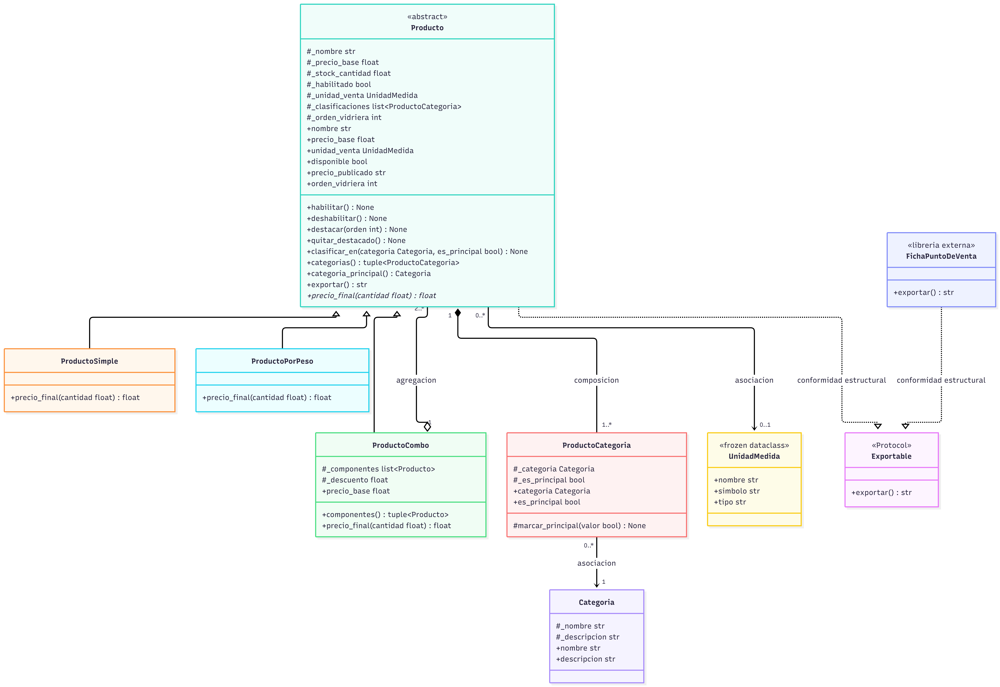

# Modelo UML final



## Código Mermaid

```mermaid
classDiagram

class Exportable {
    <<Protocol>>
    +exportar() str
}

class Producto {
    <<abstract>>
    #_nombre str
    #_precio_base float
    #_stock_cantidad float
    #_habilitado bool
    #_unidad_venta UnidadMedida | None
    #_clasificaciones list~ProductoCategoria~
    #_orden_vidriera int | None
    +nombre str
    +precio_base float
    +unidad_venta UnidadMedida | None
    +disponible bool
    +precio_publicado str
    +orden_vidriera int | None
    +habilitar() None
    +deshabilitar() None
    +destacar(orden int) None
    +quitar_destacado() None
    +clasificar_en(categoria Categoria, es_principal bool) None
    +categorias() tuple~ProductoCategoria~
    +categoria_principal() Categoria
    +exportar() str
    +precio_final(cantidad float) float
}

class ProductoSimple {
    +precio_final(cantidad float) float
}

class ProductoPorPeso {
    +precio_final(cantidad float) float
}

class ProductoCombo {
    #_componentes list~Producto~
    #_descuento float
    +componentes() tuple~Producto~
    +precio_base float
    +precio_final(cantidad float) float
}

class Categoria {
    #_nombre str
    #_descripcion str
    +nombre str
    +descripcion str
}

class ProductoCategoria {
    #_categoria Categoria
    #_es_principal bool
    +categoria Categoria
    +es_principal bool
    #marcar_principal(valor bool) None
}

class UnidadMedida {
    <<frozen dataclass>>
    +nombre str
    +simbolo str
    +tipo str
}

class FichaPuntoDeVenta {
    <<libreria externa>>
    +exportar() str
}

Producto <|-- ProductoSimple
Producto <|-- ProductoPorPeso
Producto <|-- ProductoCombo

Producto "1" *-- "1..*" ProductoCategoria : composicion
ProductoCombo "1" o-- "2..*" Producto : agregacion
Producto "0..*" --> "0..1" UnidadMedida : asociacion
ProductoCategoria "0..*" --> "1" Categoria : asociacion

Producto ..|> Exportable : conformidad estructural
FichaPuntoDeVenta ..|> Exportable : conformidad estructural